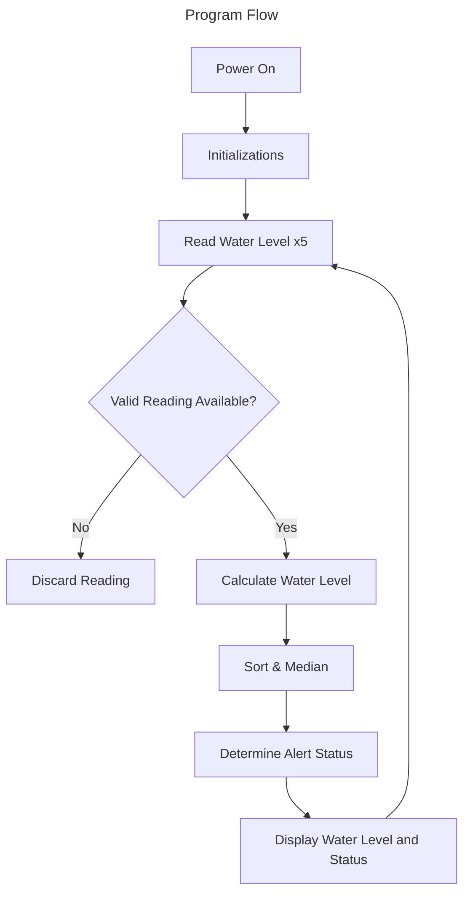

# Architecture

## Modules & Responsibilities

### config

- Define global variables
  - Pin Mapping
  - Mounting Height
  - Status Thresholds
  
### display

- OLED initialization
- Map water level to system status
- Display water level and status
- Display errors

### sensor

- Set trigger out and echo in pins on MCU
- Read distance
  - Perform multiple readings (5)
  - Iterate through readings and verify valid
  - Sort the returned valid values
- Return median value (normalize the readings) in cm
- Return -1.0f if no valid readings received
- Convert readings into water level by subtracting read distance from mounting height

### flood-detection

- high level program orchestration
- Calls functions exposed by .h files
  - sensor::begin
  - display::begin
- Calls main program loop
```cpp
void loop() {
    float waterLevel = sensor::readWaterLevelCm();  // Read the current water level from the ultrasonic sensor
    display::showWaterLevel(waterLevel);            // Update the OLED display with the current water level
 
    delay(1000);
}
```

